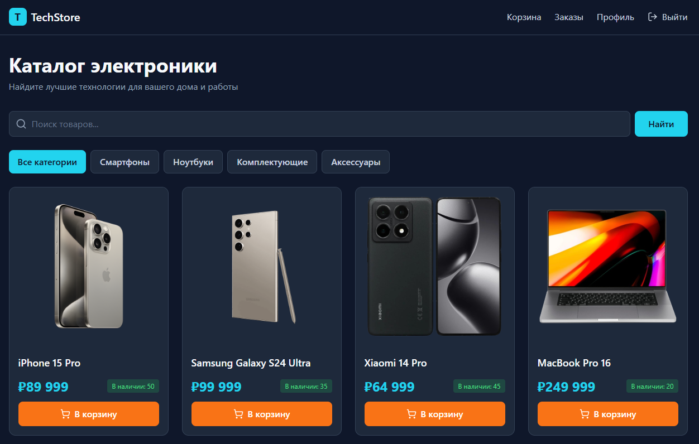
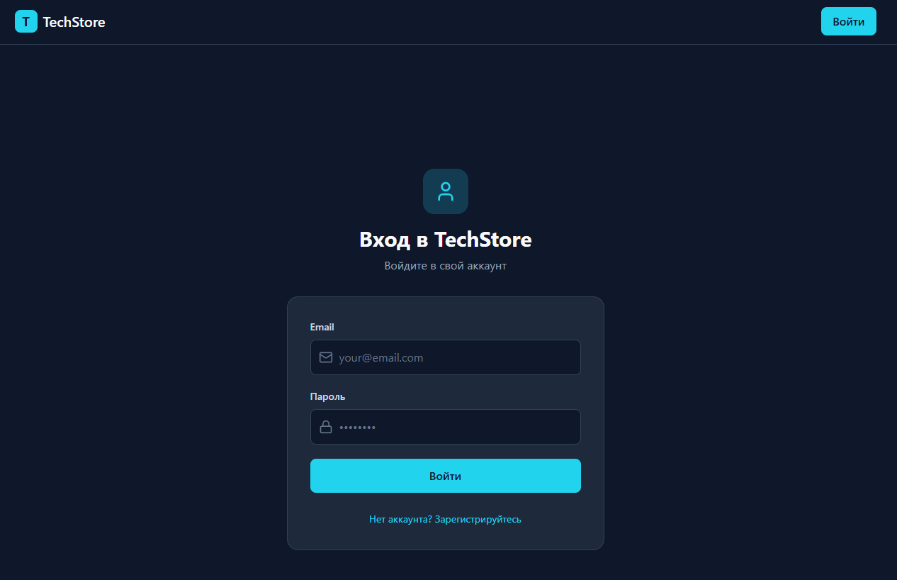

# TechStore — Web Application


**Live Demo:** [https://techstore-client](https://techstore-client-en2y.onrender.com)  


## Интерфейс приложения

| Главный каталог товаров | Форма авторизации |
| :---: | :---: |
|  |  |

---


### Backend
* **Платформа:** .NET 8 Web API
* **База данных:** MySQL (Managed Service on Aiven Cloud)
* **ORM:** Entity Framework Core
* **Аутентификация:** JWT (JSON Web Tokens) & ASP.NET Core Identity
* **Документация API:** Swagger / OpenAPI


## Локальный запуск

### 1. Клонирование репозитория
```bash
git clone [https://github.com/arthurmurzyev/TechStore-Web-App.git](https://github.com/arthurmurzyev/TechStore-Web-App.git)
cd TechStore-Web-App
