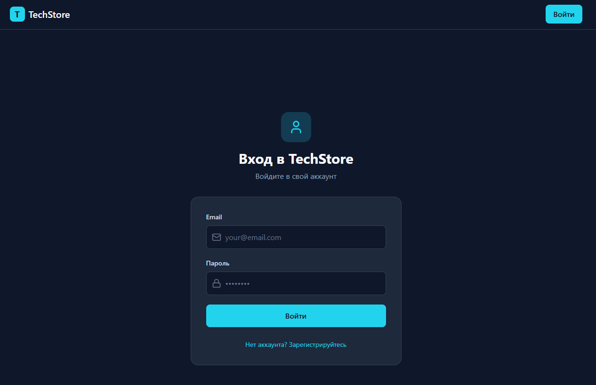
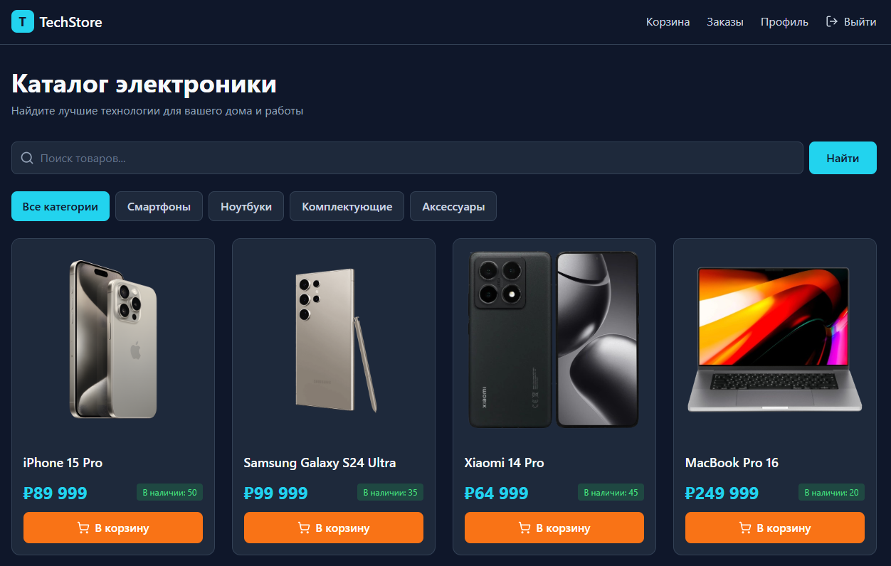

# TechStore — Web Application


**Live Demo:** [https://techstore-client-en2y.onrender.com](https://techstore-client-en2y.onrender.com)  


## Интерфейс приложения

### Форма авторизации
 

### Главный каталог товаров
 

---

### Backend
* **Платформа:** .NET 8 Web API
* **База данных:** MySQL (Managed Service on Aiven Cloud)
* **ORM:** Entity Framework Core
* **Аутентификация:** JWT (JSON Web Tokens) & ASP.NET Core Identity
* **Документация API:** Swagger / OpenAPI


## Локальный запуск (требуется Docker)

```bash
docker-compose up --build -d
```
